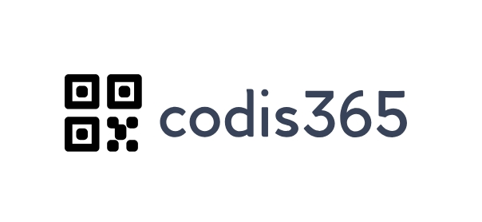

<!-- PROJECT LOGO -->
 

  
  <h3 align="center">README.MD</h3>

  

    Aquest repositori conté el codi font de la solució amb tots els projectes o llibreries de Codis365, accessible des l'enllaç https://backend.codis365.es
     
  

<!-- TABLE OF CONTENTS -->
## Taula de Continguts 

1. [Introducció](#introducció)
2. [Arquitectura de la Solució](#arquitectura-de-la-solució)
   - [PresentationLayer](#presentationlayer)
   - [ExternalAPI](#externalapi)
   - [Entities](#entities)
   - [DataAccessLayer](#dataaccesslayer)
   - [BusinessLogicLayer](#businesslogiclayer)
   - [Resources](#resources)
   - [Tests](#itests)
3. [Requisits](#requisits)
4. [Instal·lació i Configuració](#instal·lació-i-configuració)
5. [Execució](#execució)
   - [Mode Local](#mode-local)
   - [Mode de Producció](#mode-de-producció)
6. [Estructura del Codi](#estructura-del-codi)
7. [Proves](#proves)
8. [Contribució](#contribució)
9. [Llicència](#llicència)
